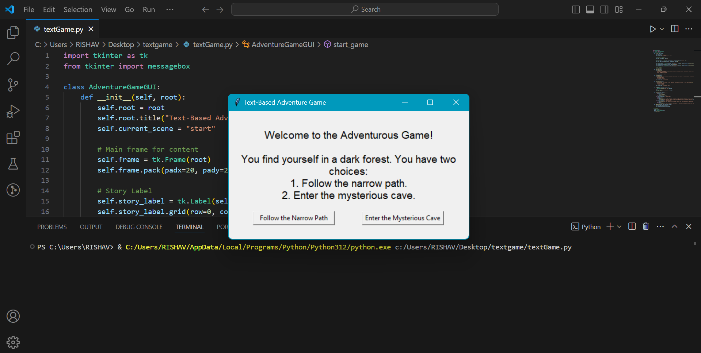

# Simple-Text-Based-Adventure-Game
Created a text based adventure game where users can make choices that affect the outcome

---
## ✨Features of the GUI Text Adventure Game:
- **Story Display:The current scene's story is shown in a text label.**
- **Choices:Players click buttons to make their decisions, which affect the game's outcome.**
- **Multiple Endings:Different endings based on the player's choices**
- **Restart Option:The game restarts after reaching an ending.**

---
## How to play 🕹️ 
- **Run the script.**
- **Read the story and click one of the two buttons to make a choice.**
- **The story progresses based on your choice until you reach an ending.**
- **The game restarts after an ending is reached.**

---
## 📷Screenshots

### UI and Working

